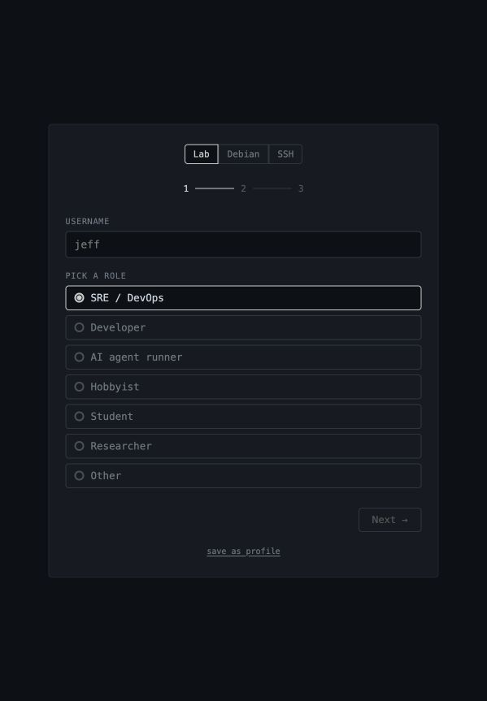
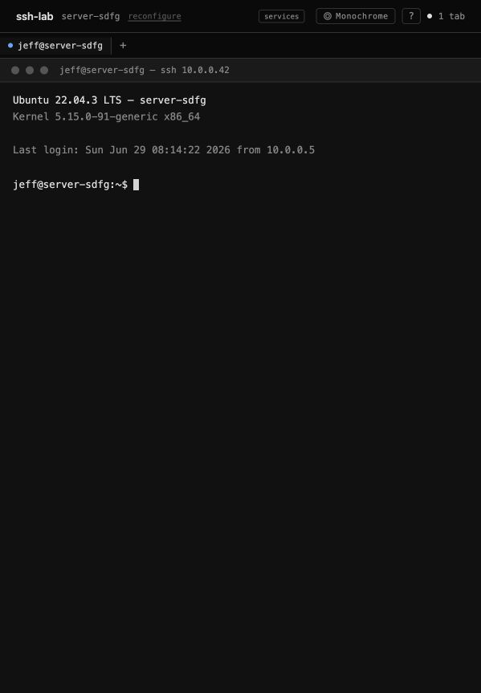
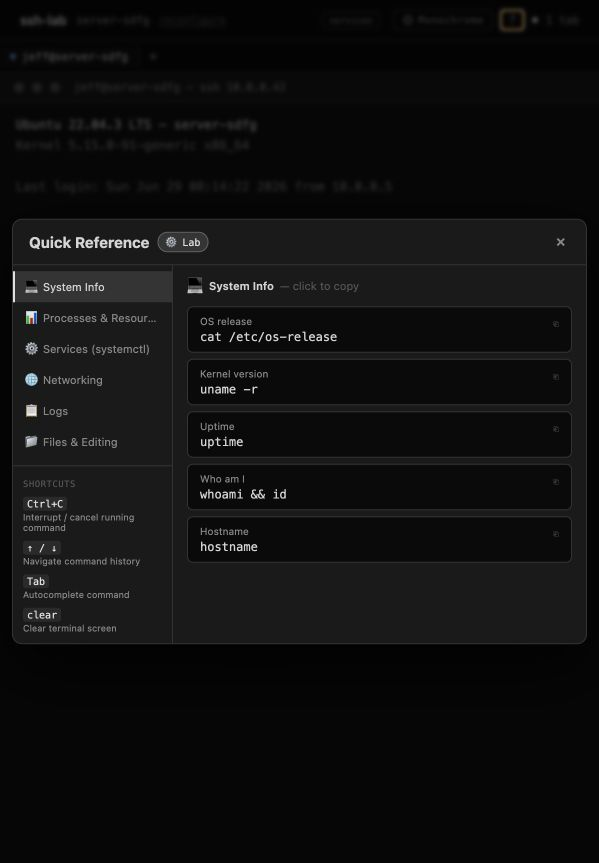
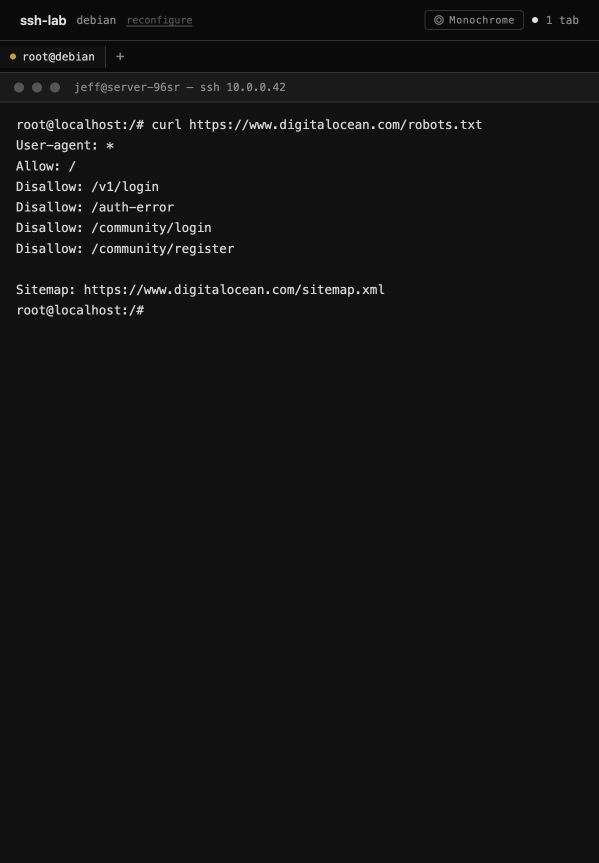
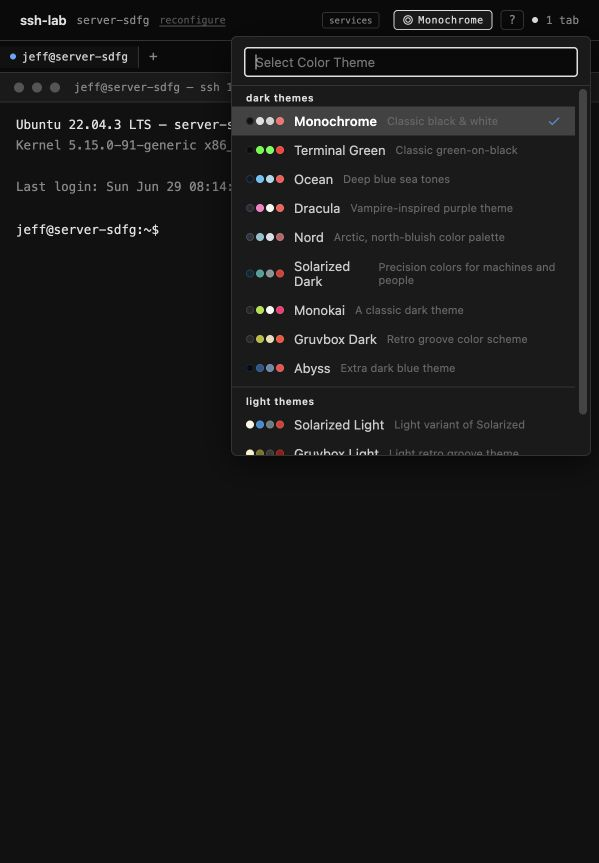

# ssh-lab

A browser-based SSH lab for practicing Linux commands, monitoring workflows, and DevOps scenarios — runs entirely in your browser via WebAssembly.

** Try it live:** [jeffasante.github.io/ssh-lab](https://jeffasante.github.io/ssh-lab/?mode=wasm)

---

## Screenshots

| Onboarding | Lab Terminal |
|:---:|:---:|
|  |  |

| Help Modal | Debian Container |
|:---:|:---:|
|  |  |

| Theme Picker |  |
|:---:|:---:|
|  |  |

---

## Modes

| Mode | Description | Backend needed |
|---|---|---|
| **Lab** (simulated) | Fake Linux server with 7 services — instant startup | None (WASM) |
| **🐧 Debian** | Real Debian Linux VM in the browser via container2wasm | None (WASM) |
| **🐍 Python** | Debian + Python 3 — run scripts, REPL, pip | None (WASM) |
| **SSH** | Proxy to a real SSH server | Go server |
| **Docker** | Full stack via `docker compose up` | Go server |

---

## Features

### Lab (simulated engine)
- 7 live services: `nginx`, `postgresql`, `redis`, `node-api`, `prometheus`, `alertmanager`, `node-exporter`
- Full command set: `systemctl`, `journalctl`, `ps aux`, `top`, `df`, `free`, `netstat`, `curl`, `ping`, `docker`, and 150+ more
- Start/stop/restart services — sidebar updates live
- Virtual filesystem: `/proc/cpuinfo`, `/etc/nginx/nginx.conf`, `/etc/passwd`, `~/.bashrc`, and more
- Scenarios: healthy, services-down, high-load, disk-full

### Debian / Python containers (container2wasm)
- Real Linux kernel running in WASM — real commands, real output
- `curl https://...` routed via CORS proxy — works on GitHub Pages
- Session tabs preserved across reloads (`localStorage`)

### UI
- **`?` Quick Reference modal** — mode-aware command cheatsheet (Lab / Debian / Python)
- **Tab autocomplete** for commands, services, flags, and files
- **Command history** with `↑`/`↓` arrow keys
- **11 themes** — Monochrome, Terminal Green, Ocean, Dracula, Nord, Solarized, Monokai, Gruvbox, Abyss, and more
- **Multi-tab sessions** — open multiple terminals, tabs persist on reload
- **Copy output** button on Debian/Python terminal
- **Mobile responsive** — full touch support, responsive theme picker and help modal
- **Onboarding wizard** — custom username, hostname, OS preset, scenario

---

## Quick start

### Try in the browser (no install)

```
https://jeffasante.github.io/ssh-lab/?mode=wasm
```

For the Debian/Python real container:
```
https://jeffasante.github.io/ssh-lab/?mode=wasm&c2w=1
```

### Run locally with Docker

```bash
docker compose up --build
# Open http://localhost:3002
```

### Run locally (manual)

```bash
# Terminal 1 — backend
cd server && go run .

# Terminal 2 — frontend
cd frontend && npm install && npm run dev
# Open http://localhost:5173

# WASM mode (no backend):
# Open http://localhost:5173?mode=wasm

# Debian container2wasm:
# Open http://localhost:5173?mode=wasm&c2w=1
```

> **Note:** The Debian/Python container requires `SharedArrayBuffer`, which needs cross-origin isolation headers (`COOP: same-origin`, `COEP: require-corp`). The Vite dev server sets these automatically. On static hosts, `coi-serviceworker.js` handles it.

---

## Commands reference

### Lab mode
| Command | Description |
|---|---|
| `systemctl status [svc]` | Show service status |
| `systemctl start/stop/restart [svc]` | Control a service |
| `journalctl -u [svc]` | View service logs |
| `ps aux` | All processes |
| `top` | Process snapshot |
| `df -h` | Disk usage |
| `free -h` | Memory usage |
| `docker ps` | List containers |
| `curl localhost:PORT` | Probe a service |
| `ping HOST` | Ping a host |
| `help` | Full command list |

### Debian container
| Command | Description |
|---|---|
| `apt-get install -y curl` | Install packages |
| `curl https://example.com` | Fetch URLs (CORS proxied) |
| `ip addr` | Network interfaces |
| `python3 -c "..."` | Run Python (if python.wasm) |

### Python container
| Command | Description |
|---|---|
| `python3` | Interactive REPL |
| `python3 script.py` | Run a script |
| `python3 -c "import math; ..."` | One-liner |
| `pip install ...` | Install packages |

---

## Project structure

```
ssh-lab/
├── server/
│   ├── engine.go           # 150+ commands, state machine
│   ├── main.go             # WebSocket server (Docker mode)
│   └── main_wasm.go        # WASM exports (browser mode)
├── frontend/
│   ├── public/
│   │   ├── ssh-lab.wasm    # Compiled Go WASM engine
│   │   ├── c2w/
│   │   │   ├── debian.wasm # Debian Linux container (~130MB, LFS)
│   │   │   └── python.wasm # Debian + Python 3 (~100MB, CI download)
│   │   └── c2w-src/        # container2wasm browser workers
│   └── src/
│       ├── App.tsx
│       ├── components/
│       │   ├── Terminal.tsx
│       │   ├── Sidebar.tsx
│       │   ├── Onboarding.tsx
│       │   ├── HelpModal.tsx   # Quick reference modal
│       │   ├── ThemePicker.tsx
│       │   ├── TabBar.tsx
│       │   └── SessionTerminal.tsx
│       └── hooks/
│           ├── useSSH.ts           # Server mode (WebSocket)
│           ├── useWasmSSH.ts       # WASM mode (in-browser Go)
│           └── useContainer2Wasm.ts # Debian/Python containers
└── docker-compose.yml
```

---

## Extending

- **Add commands:** Append to the `switch cmd` block in `server/engine.go`
- **Add services:** Append to the `state.Services` map in `server/engine.go`
- **Add container images:** Drop a `.wasm` file into `frontend/public/c2w/` and add the image name to the picker in `Onboarding.tsx`
- **Add themes:** Add a theme object to `frontend/src/themes.ts`


## Stack

- **Backend**: Go + gorilla/websocket — simulates a full Linux server state in memory
